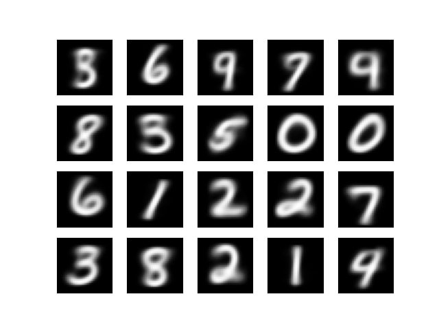

## Here's some stuff that I made

### Completed Projects

1. [Kmemes](https://github.com/jedbrooke/kmemes)<br>
Exploring the Kmeans clustering algorithm to classify and synthesize images from the internet. Implements GPU acceleration using CUDA C++. 
Generated Handwritten digits:


1. [CUDA-BWT](https://github.com/jedbrooke/cuda_bwt)<br>
A GPU based implementation of Burrows Wheeler Transform, commonly used in data compression and bioinformatics. It performs up to 10x faster than an equivalent CPU implentation in some cases.

1. [WebUI for Auto-editor](https://github.com/jedbrooke/auto-editor)<br>
Adds a web-ui to the command line program [WyattBlue/auto-editor](https://github.com/WyattBlue/auto-editor). Turns the program into a cloud service where users can upload their video, and download it when it's done processing.


1. [FPGA Face Detection](https://github.com/jedbrooke/FPGA-face-detection)<br>
Face detection, on an FPGA! A verilog implementation of a simple facial detection algorithm<br>
<br>
Uses Verilator and OpenCV to interface the verilog simulation with a webcam. 

1. [Mutlithreading enhancement for jumpcutter](https://github.com/jedbrooke/jumpcutter)<br>
A fork of [carykh/jumpcutter](https://github.com/carykh/jumpcutter), adding multithreading support for massive speedups in runtime, as fast as 5x throughput for main processing.<br>

1. [ChromeDino-FPGA](https://github.com/jedbrooke/ChromeDino-FPGA)<br>
A project in Verilog to implement a basic version of the Google Chrome no internet dinosaur game, in an FPGA <br>
This was a final project for the csm152a course at University of California, Los Angeles<br>

1. [Python Image Fetcher and Reviewer (PIFAR)](https://github.com/jedbrooke/cis41b-final-project)<br>
A Gui client for fetching results from imgur's API, and filtering them.<br>
This was a final project from the cis41b advanced python course at De Anza college<br>


1. [A Simple Store in C++](https://github.com/jedbrooke/CIS-22C-Team-4)<br>
This project is a simple store interface with a GUI written entirely in C++/GTK.<br>
This was a final project from the cis22c data structures course at De Anza college<br>


### Works in Progress
1. [RISCV-CPU](https://github.com/jedbrooke/RISCV-CPU)<br>
A RISCV CPU core implementation in Verilog, supports most of the RV32/64I instruction set. <br>

1. [Verilog-3D-graphics](https://github.com/jedbrooke/verilog-3d-graphics)<br>
A project where I explore the world of 3D graphics, both raster and ray tracing, in Verilog and FPGAs<br>

1. [CUDA JPEG compressor](https://github.com/jedbrooke/toojpeg)<br>
A fork of [stbrumme/toojpeg](https://github.com/stbrumme/toojpeg), adding CUDA acceleration to a simple jpeg compressor. <br>


<!-- ### Coming Soon!

Status: coming soon

1. Verilog Bitonic Sorter<br>
A parallel Bitonic sort implementation in Verilog. -->


<!-- ### Markdown

Markdown is a lightweight and easy-to-use syntax for styling your writing. It includes conventions for

```markdown
Syntax highlighted code block

# Header 1
## Header 2
### Header 3

- Bulleted
- List

1. Numbered
2. List

**Bold** and _Italic_ and `Code` text

[Link](url) and 
```

For more details see [GitHub Flavored Markdown](https://guides.github.com/features/mastering-markdown/).

### Jekyll Themes

Your Pages site will use the layout and styles from the Jekyll theme you have selected in your [repository settings](https://github.com/jedbrooke/jedbrooke.github.io/settings). The name of this theme is saved in the Jekyll `_config.yml` configuration file.

### Support or Contact

Having trouble with Pages? Check out our [documentation](https://docs.github.com/categories/github-pages-basics/) or [contact support](https://github.com/contact) and we’ll help you sort it out. -->
